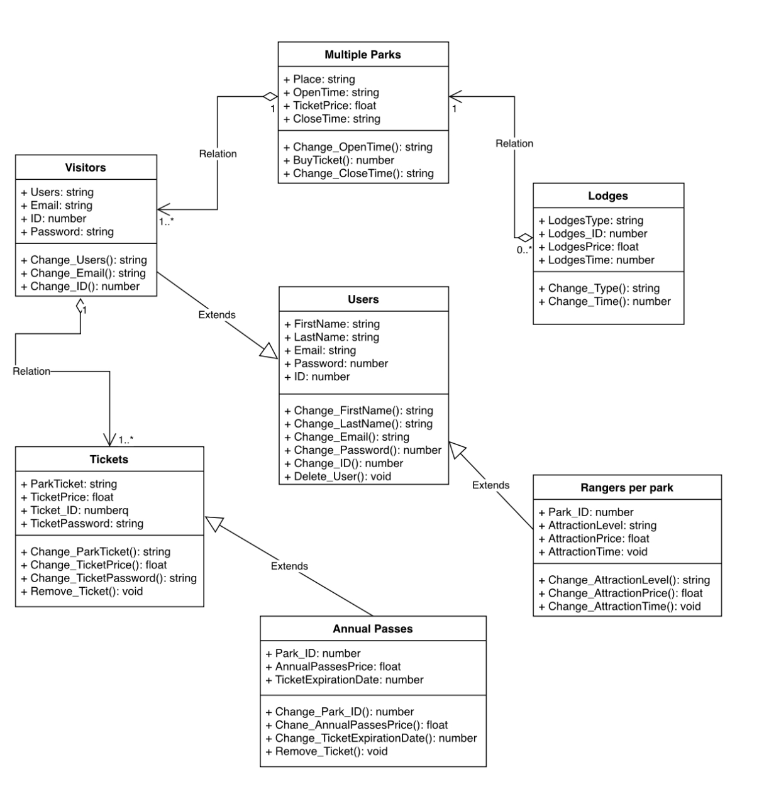

# Welcome to National Parks Uml
Welcome to my project National Parks Uml

## Task
https://app.diagrams.net/#HMuhammadqodir28%2FNational_Park_Uml%2Fmain%2FNational_Park_UML</br>
This is my <a href="https://github.com/Muhammadqodir28/National_Park_Uml.git">Github</a>

## Description
UML, which stands for Unified Modeling Language, is a way to visually represent the architecture, design, and implementation of complex software systems. When you're writing code, there are thousands of lines in an application, and it's challenging to keep track of the relationships and hierarchies within a software system. UML diagrams divide that software system into components and subcomponents.


## Installation
no need install anything for this project

## Usage
Shuhratov Muhammadqodir shuhrato_m
```
./my_project argument1 argument2
```

### The Core Team


<span><i>Made at <a href='https://qwasar.io'>Qwasar SV -- Software Engineering School</a></i></span>
<span></span>
